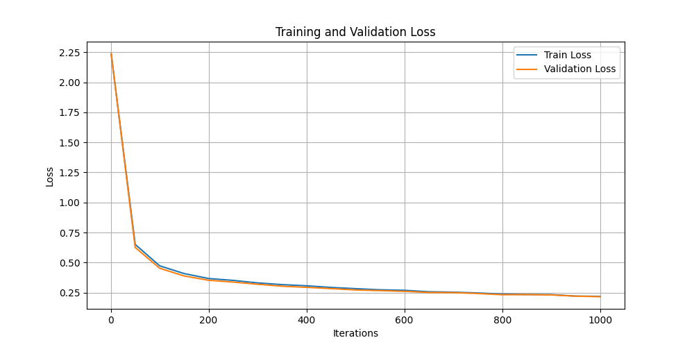
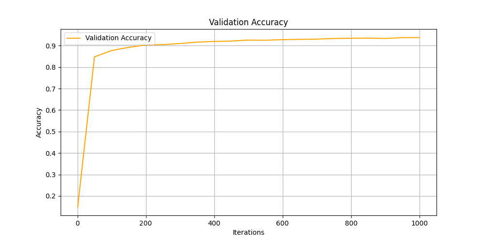

# MNIST Neural Network

This project is an adaptation of a school assignment, modified to train a fully-connected neural network on the MNIST handwritten digits dataset from scratch.

## Project Overview

The goal of this project was to take a basic neural network structure implemented for a class and extend it to handle real-world image classification. The core logic—forward pass, backpropagation, and activation functions (ReLU, Softmax)—is implemented entirely in **NumPy**, providing a deep dive into the mathematics of deep learning without relying on high-level frameworks for the model architecture.

## Features

*   **From-Scratch Implementation**: No deep learning libraries (like PyTorch or Keras) used for the model logic.
*   **MNIST Integration**: Adapted data loading pipelines to process the 28x28 grayscale MNIST images.
*   **Performance Tracking**: Implemented metrics to track training loss, validation loss, and accuracy per iteration.
*   **Visualization**: Generates learning curves to visualize the training process.

## Results & Visualization

The model achieves ~93% accuracy on the test set after 1000 iterations. Below are the generated plots showing the training progress.

### Loss Curve
Shows the decrease in Cross-Entropy Loss for both training and validation sets over time.


### Accuracy Curve
Shows the improvement in classification accuracy on the validation set.


## Prerequisites

*   Python 3.x
*   NumPy
*   TensorFlow (used solely for convenient dataset downloading)
*   Matplotlib (for generating plots)

## Installation

1.  Clone the repository.
2.  Install the required dependencies:

```bash
pip install -r requirements.txt
```

## Usage

Run the training script to train the model and generate new plots:

```bash
python3 train_mnst.py
```

## File Structure

*   `nn.py`: The core `Neural_Network` class and math functions.
*   `train_mnst.py`: Script to load MNIST data, train the model, and save plots.
*   `plots/`: Directory containing the generated performance graphs.
